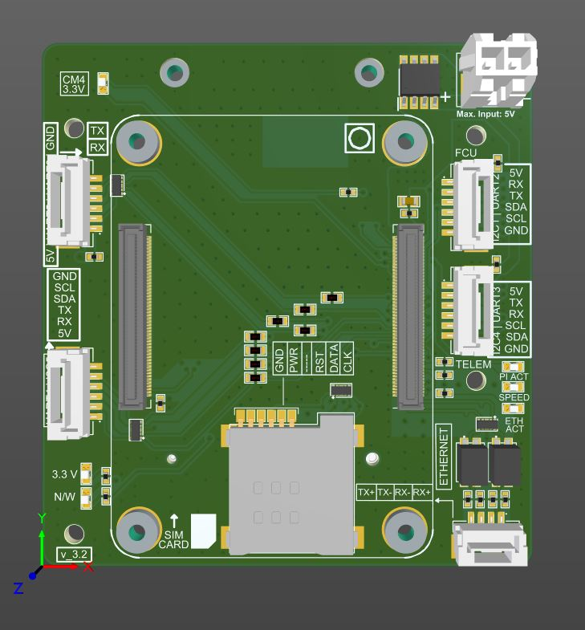
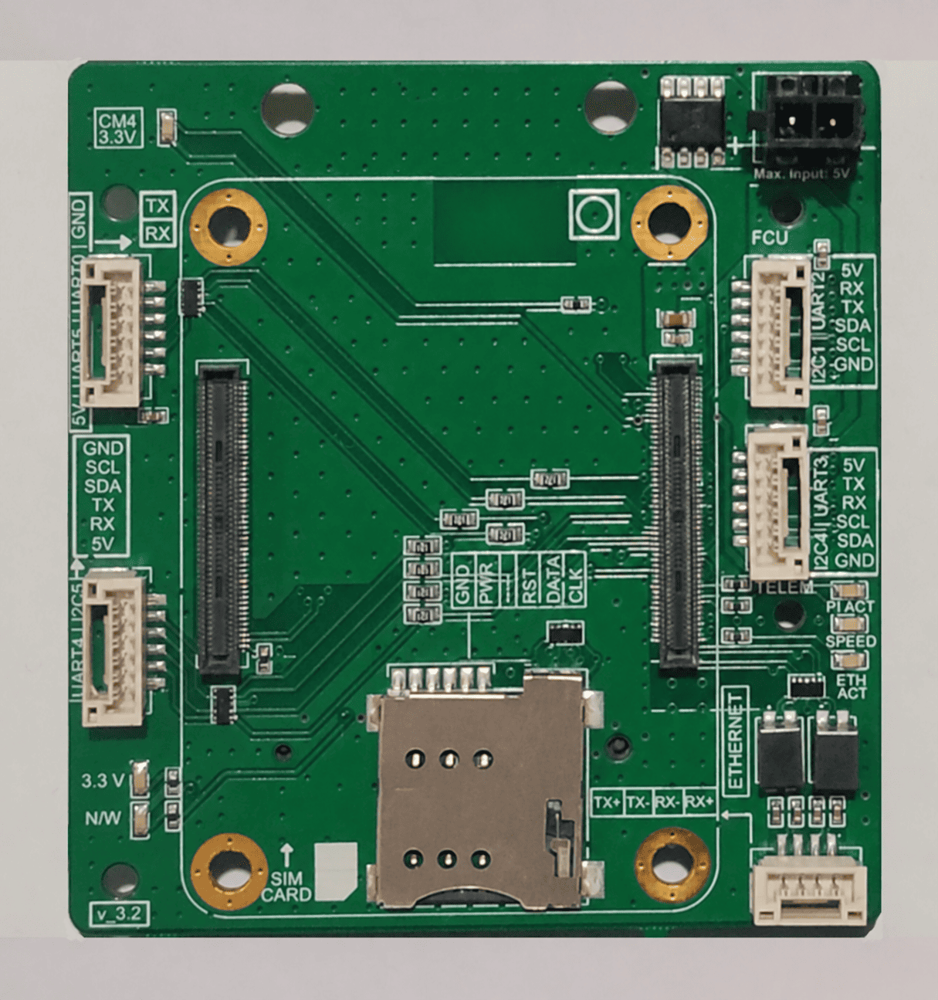
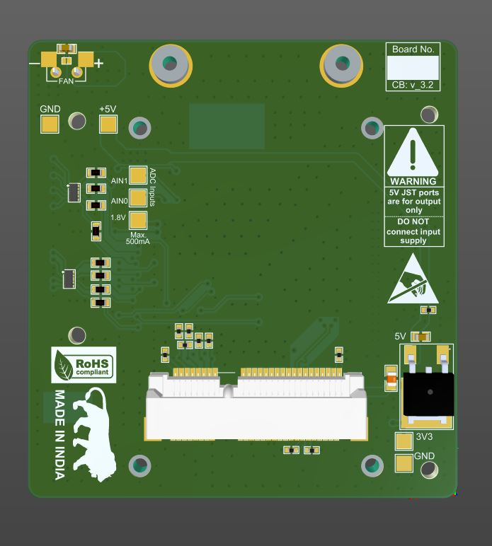
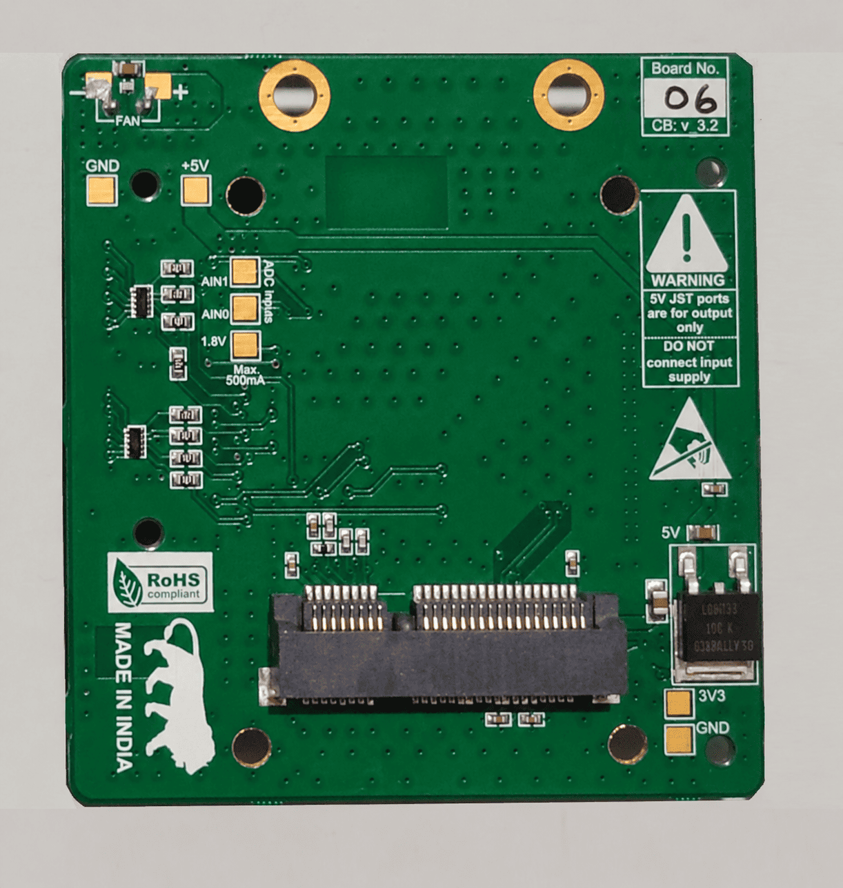
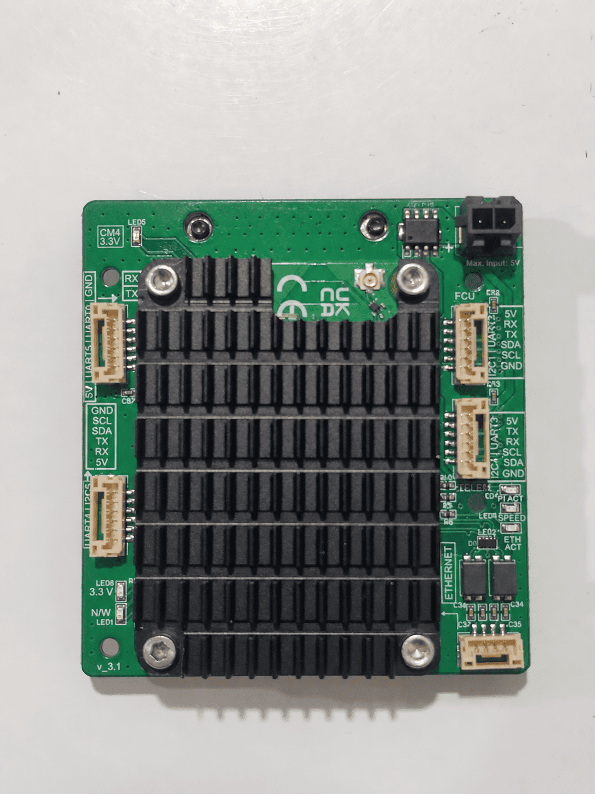
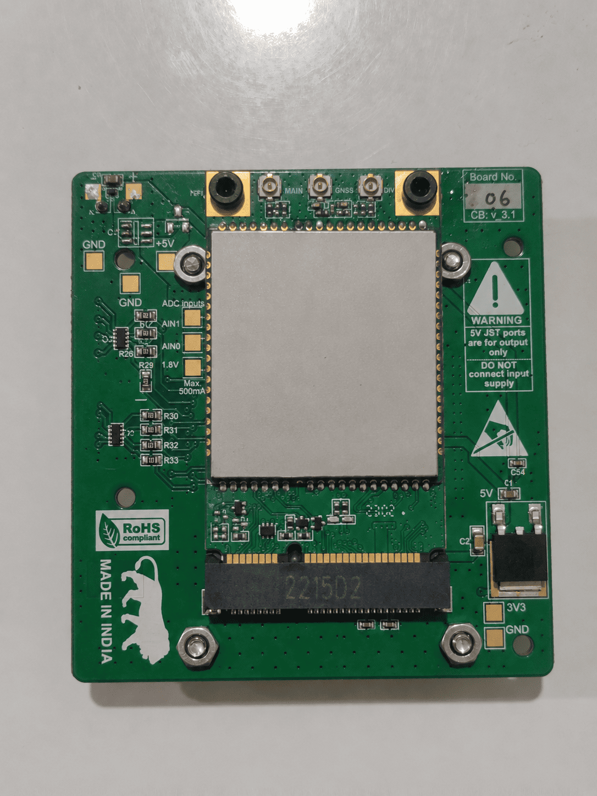
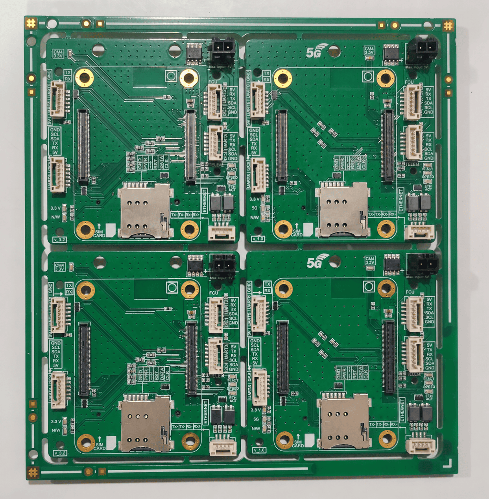

# Cellular BVLOS Drone Companion Computer

A Raspberry Pi Compute Module 4 (CM4)-based companion computer platform combining custom carrier-board hardware with an embedded Linux communication stack for cellular-connected UAVs, remote telemetry, and live video streaming.

## Features

### Hardware
- **Compute Platform:** Raspberry Pi Compute Module 4 (CM4).
- **Cellular Connectivity:** 4G/LTE modem interface through Mini PCI Express (mPCIe), with SIM and antenna connectivity.
- **Ethernet:** Ethernet interface with dedicated magnetics.
- **Flight Controller:** UART interface for Pixhawk communication.
- **Peripheral Expansion:** GPIO, UART, I²C, SPI, and PWM interfaces for external modules and sensors.
- **Power Supply:** 5 V input with 3.3 V regulation.
- **Protection:** Reverse-polarity protection, input transient protection, and ESD protection on external interfaces.
- **Status Indication:** LEDs for processor and network activity.
- **PCB Design:** Four-layer FR-4 PCB with dedicated ground planes and controlled-impedance routing.
- **Dimensions:** Approximately 61 × 65 × 13.7 mm.

### Firmware & Software
- **Cellular Network Management:** LTE modem initialization, network registration, connectivity monitoring, and automatic recovery.
- **Remote Telemetry:** MAVLink routing between the flight controller, ground control station, and onboard applications.
- **Live Video Streaming:** Low-latency H.264 encoding and RTSP/WebRTC streaming over cellular networks.
- **Link Health Monitoring:** Cellular signal quality, latency, jitter, and packet-loss monitoring with a Link Health Index.
- **Secure Remote Access:** VPN connectivity using Tailscale, including access through carrier-grade NAT (CGNAT).
- **Reliable Operation:** Embedded Linux services with automatic startup, restart, logging, and fault recovery.

## Applications
- Cellular-connected UAVs and BVLOS communication.
- Remote flight telemetry and drone monitoring.
- Live video streaming over LTE networks.
- Remote diagnostics and companion-computer management.

## PCB Images

### Top View

  
  

### Bottom View

  
  

### Additional PCB Views

  
  

### PCB Panel

  

